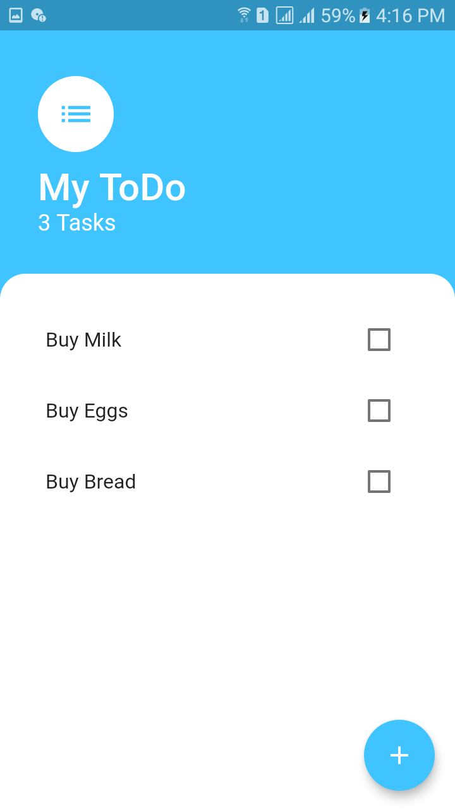
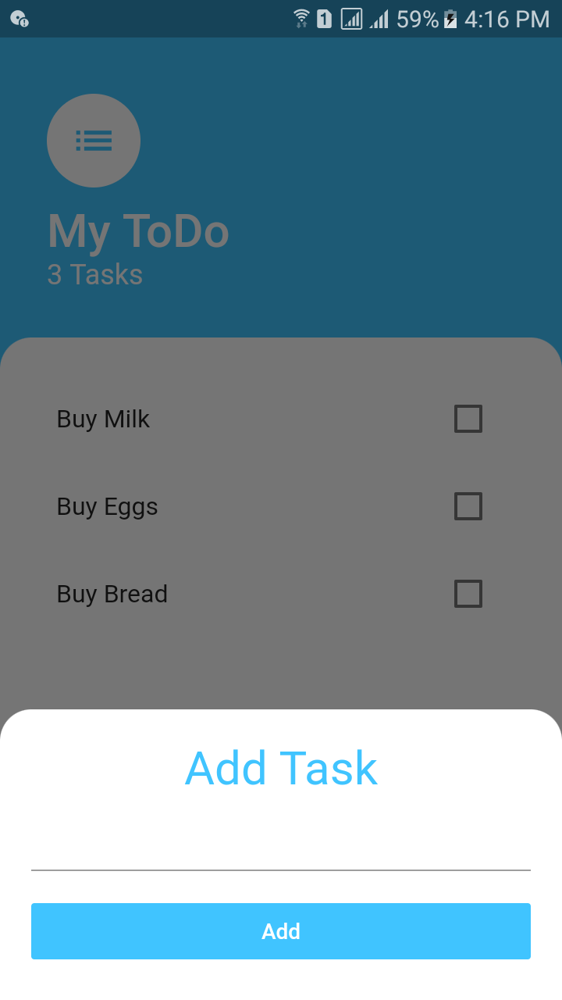
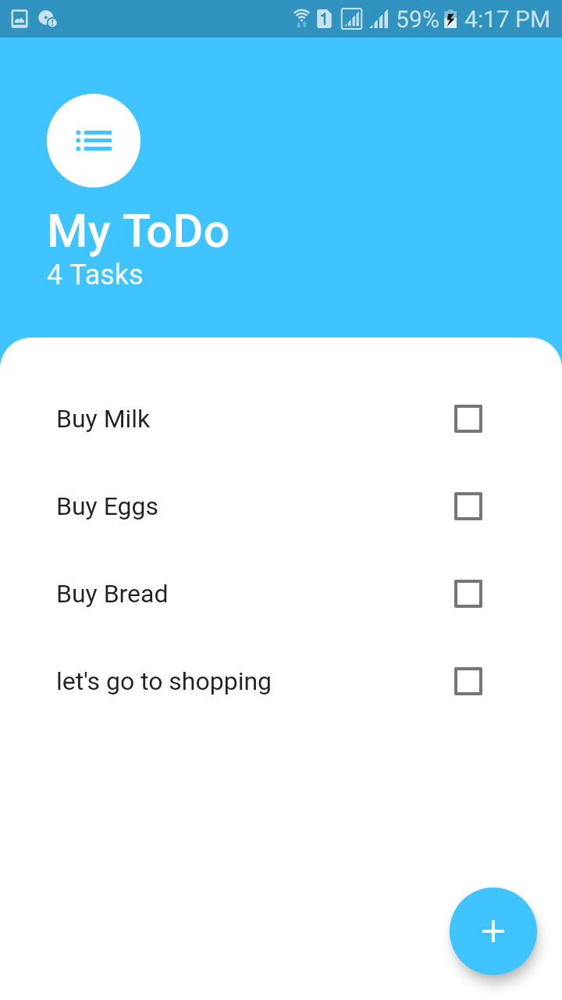
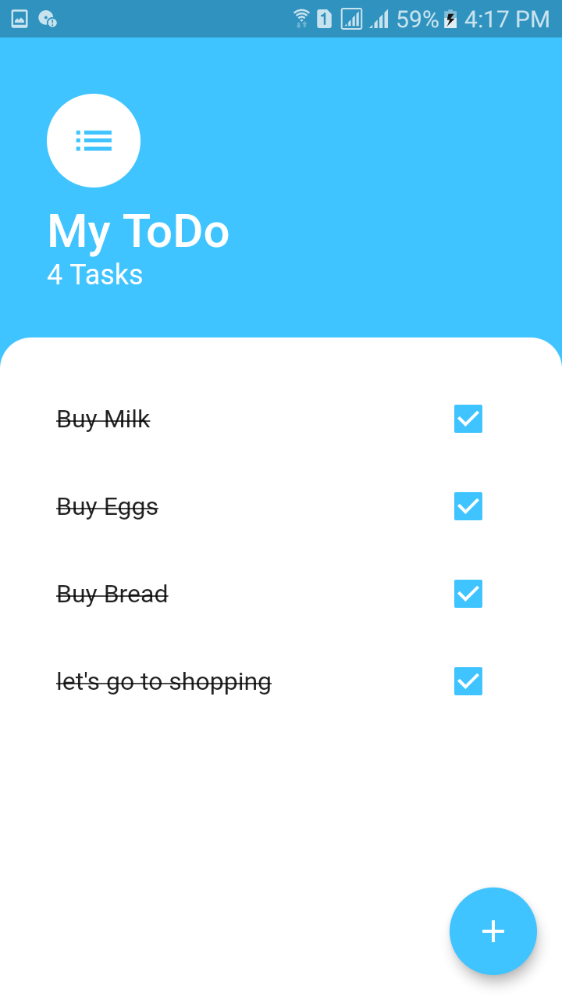

# to_do

# What you will learn

- How to use statemanagement 
- How to Use provider for ur app statemanagement
- How to custom widget use and many more

#############ScreenShots#################

   
